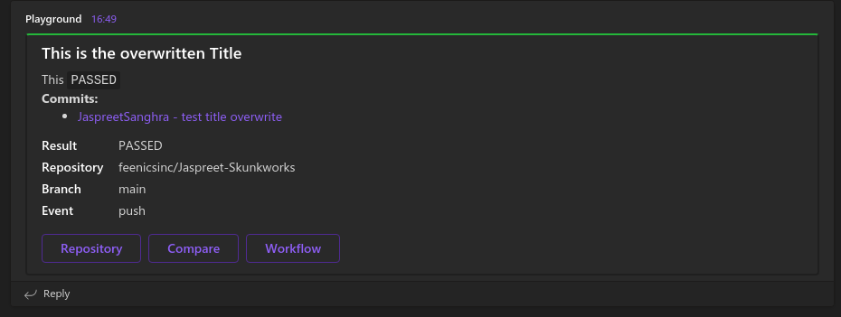

# workflow-result-teams-notification

Send a notfication to MS Teams indicating the result of the Github Action Workflow

## Inputs

### `description`

**Required**  
Provide the text of the teams message. This is displayed directly underneath the Title of the message card.  
> example: Api Build 22.1.1 Passed

### `workflow`

**Required**  
This is the Github object information in your workflow.  
It must be provided as `${{ toJson(github) }}`

### `webhook`

**Required**  
The webhook URL of where to POST the message.

### `job`

**Required**  
This is the github Job information object in your workflow.  
It must be provided as `${{ toJson(job) }}`

### Optional Inputs

### `title_override`

When provided, overrites the default title format.  
The default title is `[{REPOSITORY_NAME}] - [{WORKFLOW_NAME}]`  
> example:  `[feenicsinc/workflow-result-teams-notification] - [Build PR and Deploy to DEV]`

### `steps`

Provided as `${{ toJson(steps) }}`  
Used only for failed job messages to show which step failed.

### `needs`

Provided as `${{ toJson(needs) }}`  
> Not Implemented

## Outputs

Success

Failure

Incase Of Internal Error - Basic Notification

## Example usage

        -   name: Failure Notification
            if: failure()
            id: Failure_Notification
            uses: feenicsinc/workflow-result-teams-notification@master
            with:
                description: "API Build `22.1.1` FAILED"
                workflow: ${{ toJson(github) }}
                webhook: ${{ secrets.PLAYGROUND_WEBHOOK }}
                job: ${{ toJson(job) }}
                steps: ${{ toJson(steps) }}
                needs: ${{ toJson(needs) }}  

        -   name: Success Notification
            if: success()
            id: Success_Notification
            uses: feenicsinc/workflow-result-teams-notification@master
            with:
                description: "API Build `22.1.1` PASSED"
                workflow: ${{ toJson(github) }}
                webhook: ${{ secrets.PLAYGROUND_WEBHOOK }}
                job: ${{ toJson(job) }}
                steps: ${{ toJson(steps) }}

        -   name: Teams Notification with Title Override
            id: Teams_Notification
            uses: feenicsinc/workflow-result-teams-notification@master
            with:
                title_override: "Release 22.2.2"
                description: "API Build `22.1.1`"
                workflow: ${{ toJson(github) }}
                webhook: ${{ secrets.PLAYGROUND_WEBHOOK }}
                job: ${{ toJson(job) }}
                steps: ${{ toJson(steps) }}
                needs: ${{ toJson(needs) }}
